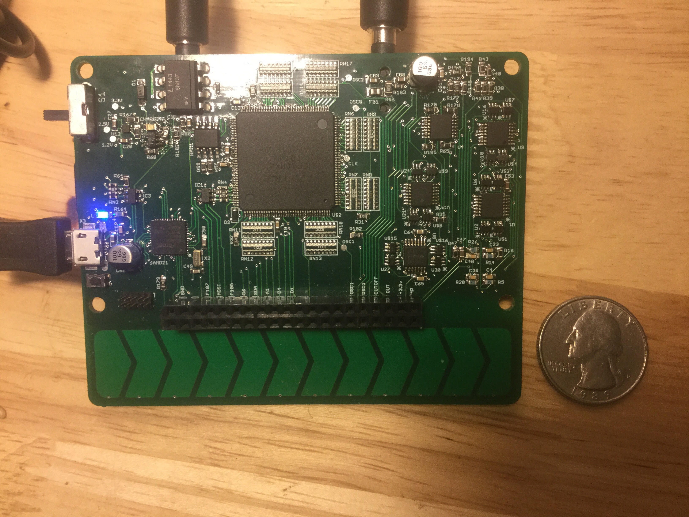

# bottomfeeder

demo video of the synthesizer with a control panel added on top is [here](https://youtu.be/Ub5NRgZzTfE).
Note the synthesizer is mounted to the back of the panel in the video.

Features include:
- 3x 16 bit digital Wavetable Oscillators (sample rates up to 200k samples/sec)
  - Fine and coarse tuning controls for each oscillator
  - user loadable waveforms
  - 1 square wave sub oscillator for each oscillator
- Full analog 4 pole resonant low pass filter
- ADSR envelope generator mappable to filter cutoff and VCA
- Monophonic and 3 voice Paraphonic modes
- Glide rate control
- 2x LFO (also any user loadable waveform)
  - Mappable to many parameters including rate or depth of the other LFO
- External input to filter
- All parameters controllable via Standard MIDI
- Header connections for modification
- Loading and saving presets
- Low cost and small form factor

## Structure
An ARM Cortex M0+ microcontroller acts as a host processor for an [FPGA-Based synthesizer](https://github.com/deanm1278/Chisel-wavetable).
The FPGA outputs the oscillators as well as PWM control voltages for the analog filter and analog VCA parameters.
[Click here](https://github.com/deanm1278/bottomfeeder/blob/master/schematics/synth_revD.pdf) to view PDF schematics.
